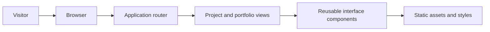

# Jahwanth Portfolio

A personal portfolio application for presenting selected work, projects, and technical direction in a focused web experience.

## What it demonstrates

The project is a TypeScript web application built with React, Vite, and TanStack Router. It emphasizes clear navigation, reusable interface components, and a responsive presentation of project information.

## Architecture



The router selects a page view, which composes reusable interface components and static assets. The application remains intentionally lightweight so content can be iterated quickly.

## Local development

Install dependencies and start the development server:

```bash
npm ci
npm run dev
```

Run the quality checks before opening a pull request:

```bash
npm run lint
npm run build
```

## Project standards

The repository includes contributor guidance and a GitHub Actions workflow that validates linting and production builds on pushes and pull requests.
